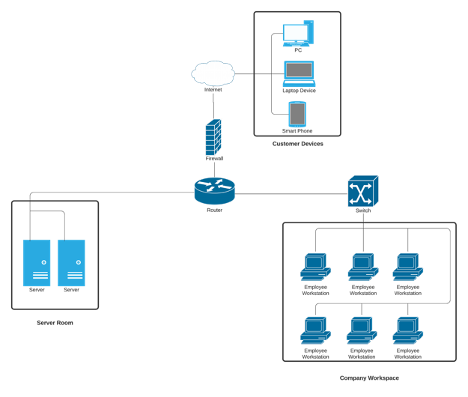
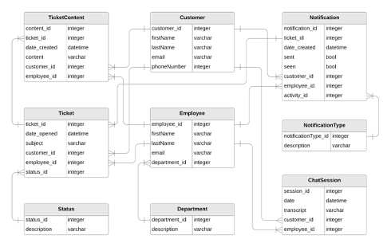

# Ticket-Ask
ASU - Senior Capstone Project

### Table of Contents
- [Project Charter](#Project-Charter)
- [Functions & Requirements](#Business-Requirements)
   1. [Client and Employee Web Portal](#Client-and-Employee-Web-Portal)
   2. [Ticket Management](#Ticket-Management)
   3. [Alert System](#Alert-System)
   4. [File Upload](#File-Upload)
- [System Design](#System-Design)
   * [Network Topology Diagram](#Network-Topology-Diagram)
   * [Entity-Relationship Diagram](#Entity-Relationship-Diagram)
   * [Security and Privacy Architecture](#Security-and-Privacy-Architecture)

### Project Charter
TicketAsk is a helpdesk system that offers a Customer and Employee Portal that meets the necessary requirements needed to have the main functions to manage tickets be notified of ticket progress and communicate back and forth with the support team until ticked is resolved.

### Business Requirements

#### Client and Employee Web Portal

#### Ticket Management
* Requirements:
  - The system will allow the user to open a new ticket.
  - The system will allow the user to edit an existing ticket.
  - The system will allow the user to close a fulfilled or resolved ticket.
  - The system will allow the user to view the status of open tickets.
  - The system will allow agents to request additional information on tickets.
  - The system will retain all past tickets.
  - The system will allow the user to filter and search through past and current tickets.

#### Alert System
* Requirements:
  - The system will alert the customer when their ticket has been completed and closed.
  - The system will alert the customer when a request for more information has been made.
  - The system will alert the customer when any partial work has been done on their ticket.
  - The system will alert the customer when a new technician or agent has been assigned to their ticket.

#### File Upload
* Requirements:
  - The system will allow the customer to upload .docx files.
  - The system will allow the customer to upload .pdf files.
  - The system will allow the customer to upload .jpeg and .png files.
  - The system will allow the customer to upload .zip files.
  - The system will allow the customer to delete uploaded files.
  - The system will display an error message for unsupported file types.
  - The system will display an error message for files that are too large.
 
### System Design

#### Network Topology Diagram

#### Entity-Relationship Diagram

