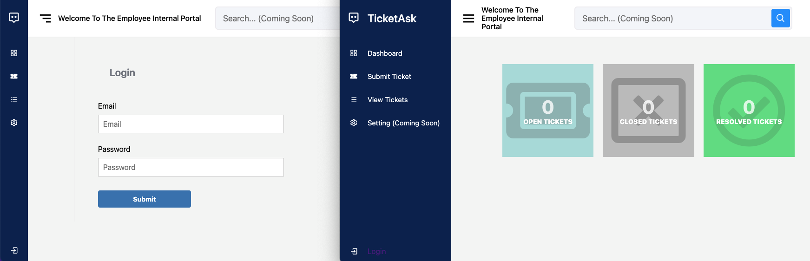

# Ticket-Ask
ASU - Senior Capstone Project

## Table of Contents
1. [Project Charter](#Project-Charter)
  * [Problem Statement]
  * [Technology Solution]
  * [Project Benefits]
2. [Business Requirements]
  * [Functions and Requirements]
3. [System Design]
  * [User Interface - Wireframes]
4. [Infrastructure Architecture]
  * [Network Topology Diagram]
5. [Information Architecture]
  * [Entity-Relationship diagram]
6. [Security and Privacy Architecture]
7. [Programming]

